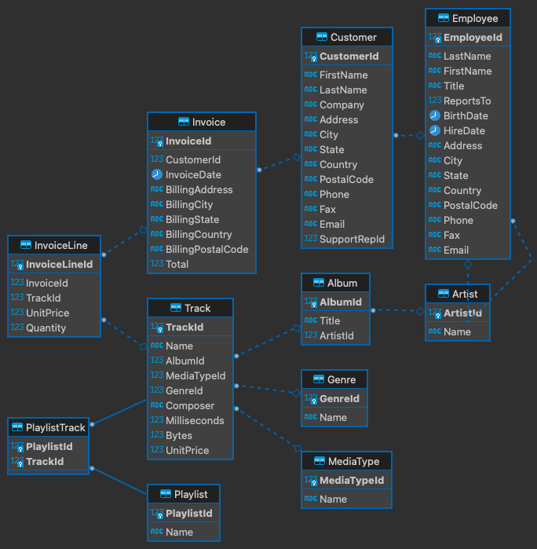

# NodeJS Code Test

## Description

You've been handed over this project from the previous developer, who had to move to another project. He just started working on this, but couldn't complete all the business requirements. The project is about having a REST API that would serve a frontend app for selling audio tracks. Your job is to finish this API according to the requirements that are grouped in 2 levels. We're not expecting that you complete both levels, however **Level 1 is required** to consider this code test as completed and ready for the review.

Before going through both levels' requirements, it's worth mentioning two things:

1. Project's tech stack is based on [NestJS](https://nestjs.com/) and [Postgres](https://www.postgresql.org/).

2. The data model behind this API is already defined and can be described with this ER diagram:



## Requirements

### Level 1

1. Create a `signup` endpoint for employees.
2. Create a `login` endpoint for the employees. For the credentials they will use `email` and `password`. The password should have at least 6 characters, where one is in uppercase and one is a special character. A successful request should return a JWT token. For the existing employees in the DB set a default password by your choice.
3. Create an endpoint for retrieving a list of all tracks. This endpoint should be only available to registered employees.
4. Document all these three endpoints by using OpenAPI specifications and expose the documentation on a public endpoint.
5. Write e2e and unit tests for these endpoints.
6. The code you'll write should be idiomatic NestJS.
7. Maintain a clean and readable git commit history.

### Level 2

The API already has these two endpoints:

- `GET /customers/{:id}/tracks`
- `GET /customers/pdf` (returns a list of all customers in pdf)

1. However we're not satisfied with their response times and would like you to optimize the endpoints:

   1.1 To benchmark optimization efforts, we've included a load test tool [artillery](https://www.artillery.io/). It's already configured to simulate a desired app load for both endpoints. It's important to **commit load test reports before and after the optimization** (we're expecting `before.json` and `after.json` to be committed) so we can easily see the difference in the response times. We'll focus on `http.response_time.median` metric.
   1.2 Optimization should **not** be done by scaling the app horizontally (i.e. using pm2) or using third party services.

2. After you're done with the optimizations, we'd also like you to improve [Dockerfile](./Dockerfile) to be ready for production.

## ORM & DB migrations

The project uses [Prisma ORM](https://www.prisma.io/), which is configured to introspect the DB schema and then build a typed DB client upon the introspected schema. This affects db migration flow you might be used to, therefore we've decided to describe the flow in a more detailed way:

1. For changing DB schema, we've included a db migration framework [db-migrate](https://db-migrate.readthedocs.io/en/latest/) that is already configured to use local database and expects migrations files in plain `sql`.

Here are the basic commands:

```bash
# Create a new migration file
$ npx db-migrate create <migration_name>

# Apply the schema changes
$ npx db-migrate up

# Revert the schema changes
$ npx db-migrate down
```

2. After you're done with the schema changes, introspect the schema and build the db client:

```bash
# Introspect the db schema
$ npx prisma db pull

# Build the db client
$ npx prisma generate
```

## Installation

Please read these instructions carefully.

Make sure you have installed the latest NodeJS version, Docker, Docker Compose. You would also need to have [pg_restore](https://www.postgresql.org/docs/9.2/app-pgrestore.html) available on your PATH and ports `3000` and `5432` are not already in use.

1. Install the packages and spin up a postgres database

```bash
$ npm install
$ npx prisma generate
$ docker compose up -d
```

2. Create the tables and seed the db with real data

```bash
# You'll be asked to enter a DB password. Look for it in .env (POSTGRES_PASSWORD).
$ npm run db:seed
```

3. Run the load test
   This step is required for Level 2, but we recommend doing it regardless of you're going to do Level 2 or not. As mentioned in Level 2 requirements, you'll need to commit `before.json` and `after.json` load test report in order to benchmark the optimization efforts. This step will generate `before.json`.

```bash
# run the app
$ npm run start:dev

# run load test and generate the report
npm run test:load -- -o before.json
```

## Running the app

```bash
# make sure the required services are running
$ docker compose up -d

# development
$ npm run start

# watch mode
$ npm run start:dev

# production mode
$ npm run start:prod
```

## Test

```bash
# unit tests
$ npm run test

# e2e tests
$ npm run test:e2e

# test coverage
$ npm run test:cov

# load tests - app should run on localhost:3000 before runing the load test
$ npm run test:load -- -o <load_test_report_filename.json (i.e before.json)>
```

## Credits

The data model and the data itself was taken from [chinook-database](https://github.com/lerocha/chinook-database).

## License

See the license [file](./LICENCE).
